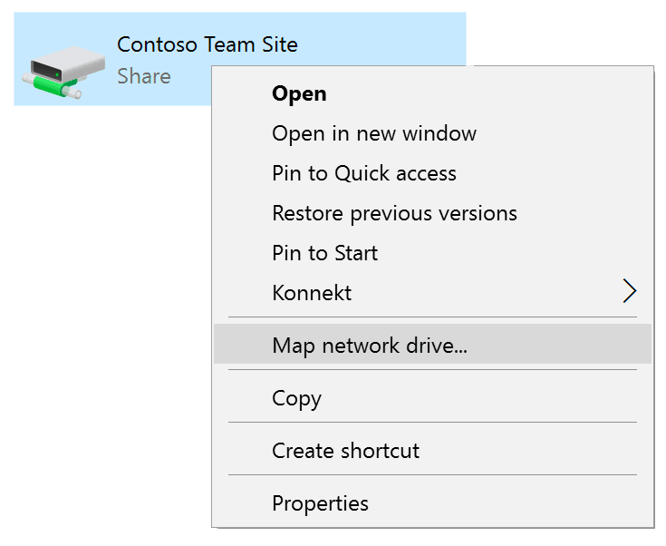

# Welcome

## Overview

KONNEKT brings files that are stored in SharePoint Online document libraries to your Windows File Explorer.&#x20;

KONNEKT works **online**. It does not sync files to your local disk and waste space there. That is why KONNEKT does a great job in **VDI** environments like **Citrix, Azure Virtual Desktop** (AVD - fka Windows Virtual Desktop WVD) or **Windows 365 Cloud PC**.

These docs cover the technical aspects of KONNEKT. All other information can be found on [https://konnekt.io/](https://konnekt.io/)

## Features

| Features                                | Explanation                                                                                                                     |
| --------------------------------------- | ------------------------------------------------------------------------------------------------------------------------------- |
| Drive Letter Mapping and Network Shares | Uses a deeply integrated network provider technology. A sophisticated implementation allows UNC paths and drive letter mapping. |
| Explorer Integrated                     | Integrates into the Windows File Explorer structure.                                                                            |
| Citrix and Terminal Services Support    | Transparent access to any SharePoint from Citrix and Terminal Services                                                          |
| Multitenancy                            | Connects to multiple tenants simultaneously                                                                                     |
| Co-authoring                            | Supports the co-authoring of Microsoft Office 365                                                                               |

## Use cases

### Type of work

KONNEKT was designed for regular office work on Windows machines (fat clients and VDI).

When it comes to applications, where bigger amounts of data with high throughput are used, like databases, graphics design, video editing or computer aided design (CAD), KONNEKT (and SharePoint Online in general) will most probably not be a satisfactory solution.

KONNEKT is not the right tool to do data-migrations, where huge amounts of files are moved from legacy repositories to SharePoint Online.

### File sizes

KONNEKT is relying on the performance of the network connection to SharePoint Online. Working with files in the one- or two-digit megabyte size is the main use-case.&#x20;

If you are working with files in the gigabyte size, the performance of your network and SharePoint Online may be an issue. We do not recommend to use KONNEKT in such use-cases and therefore KONNEKT [limits the usage of bigger files by default](configuration/other/open-file-size-limitations.md).

### File structure

KONNEKT is doing a great job in several environments. It can handle hundreds of mappings (sites & libraries) and very big libraries with 1 million files or more.

Although there are no issues with the total amount of files or folders within one library, we recommend segmenting the data within the library in folders. A maximum amount of 1000 files per single folder is a good rule of thumb.

## Architecture

KONNEKT is a client-side tool - there is no backend. **Data is transferred directly between the KONNEKT client and the SharePoint Online services**. Thus, the data neither runs over external systems, nor are they stored on the publisher systems.&#x20;

KONNEKT uses the **native Microsoft APIs** (Microsoft SharePoint and Microsoft Graph) with standard Microsoft authentication to access Microsoft 365. This means that **conditional access** is also effective for access from KONNEKT to SharePoint Online.

## KONNEKT vs. OneDrive Sync Client

The **main differences** between Microsoft **OneDrive Sync Client** and **KONNEKT** are:

| Feature                                                            |                     OneDrive Sync Client                     |                        KONNEKT                        |
| ------------------------------------------------------------------ | :----------------------------------------------------------: | :---------------------------------------------------: |
| Are the files **synced** to the local machine?                     |             
Yes

(at least partially)
            |                           No                          |
| Automatically map the SharePoint volumes, the user has access to   | 
No

(Users mark libraries to be synced manually)
 |     [Yes](configuration/mappings/auto-mapping.md)     |
| **Drive-Letter** support                                           |                              No                              | [Yes](configuration/mappings/assign-drive-letters.md) |
| Works in **VDI** environments (e.g. Citrix,  AVD/WVD, Windows 365) |                            limited                           |                          Yes                          |
| Support for **UNC** addressing                                     |                              No                              |                          Yes                          |

You have the option to use KONNEKT side-by-side with Microsoft 365 or stand-alone by replacing the OneDrive client. But in every configuration KONNEKT is a helpful leap to the Office 365 ecosytem (Office, Outlook, SharePoint,...) by providing not only the documents and data but also the right options to jump directly to the Sharepoint Online Site, providing the links to share or make the versions of a file accessible.
