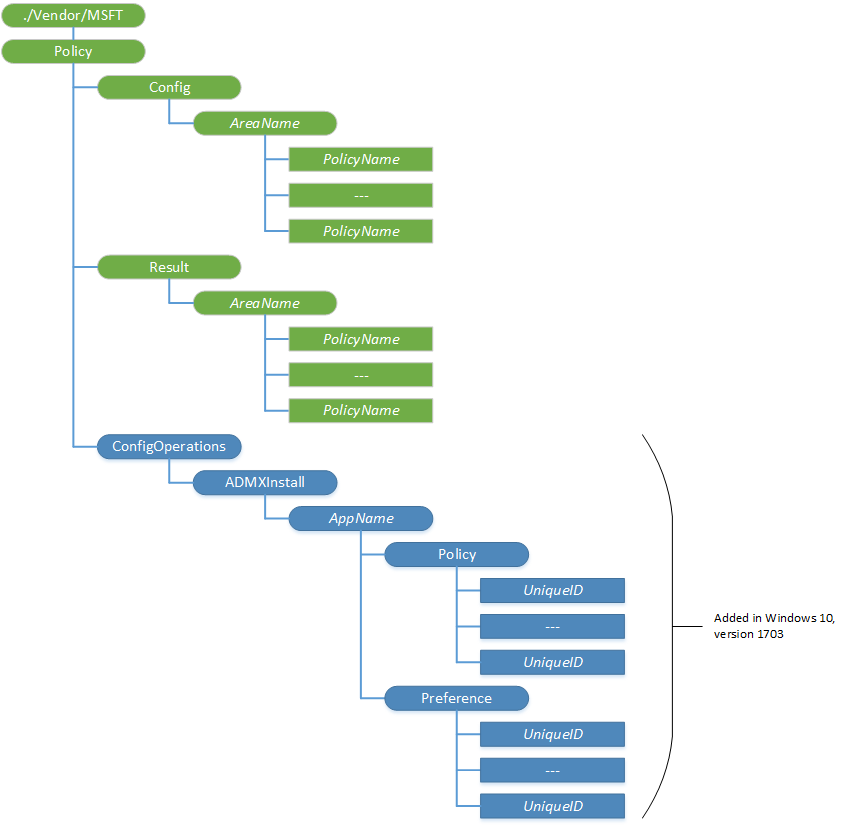
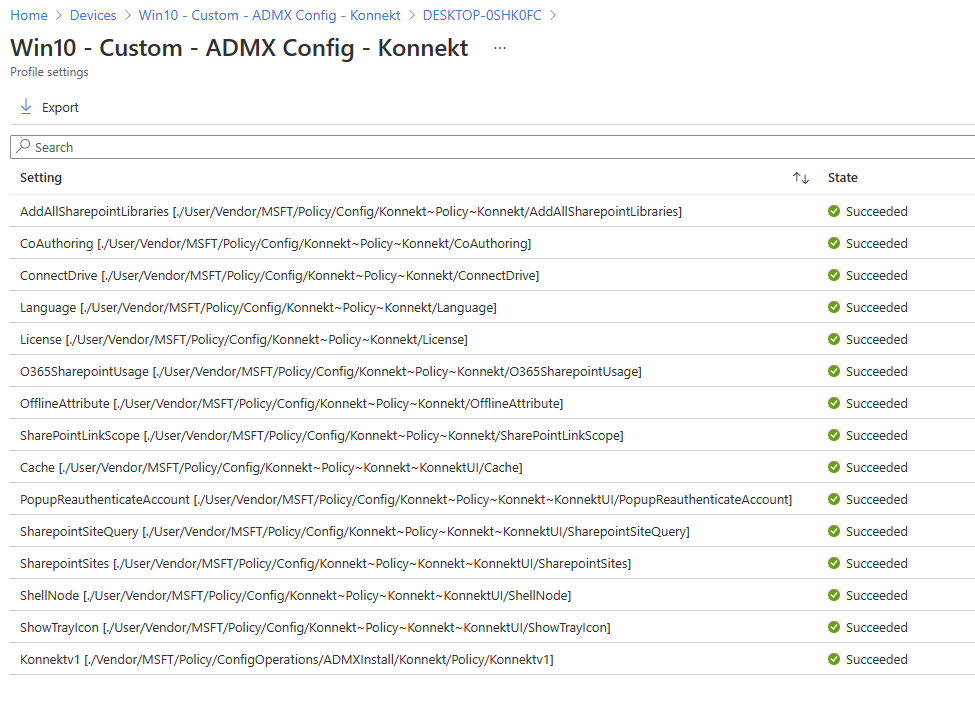
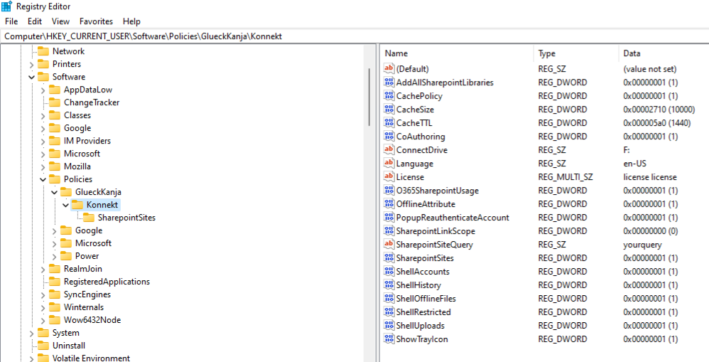

# Settings for Intune managed devices

Starting in Windows 10, version 1703, you can import ADMX files (also called ADMX ingestion) and set those ADMX-backed policies for Win32 and Desktop Bridge apps by using Windows 10 Mobile Device Management (MDM) on desktop SKUs. The ADMX files that define policy information can be ingested to your device by using the Policy CSP URI, The ingested ADMX file is then processed into MDM policies.



For more in information please visit [Understanding ADMX-backed policies](https://docs.microsoft.com/en-us/windows/client-management/mdm/understanding-admx-backed-policies) and [Policy CSP](https://docs.microsoft.com/en-us/windows/client-management/mdm/policy-configuration-service-provider)&#x20;

## Ingesting KONNEKT ADMX file **and deploying policies**

In order to set the KONNEKT policies you need to ingest the admx file in a configuration profile first:

1\. Go to your **Microsoft Endpoint Manager** portal\
2\. Click on **Devices**, then in the sub-menu go to **Configuration profiles**\
****3. **Create profile:** Select Platform **Windows 10 and later,** profile type **Templates,** in search field choose **Custom,** then **Create**


4\. Now choose a **Name** for this profile, **Next**\
****5. Under **Configuration settings:**

**First you have to** ingest the admx file: **Add** new Row

Click on **Add** then in the new window:

* **Name:** choose a name, e.g. KonnektAdmxIngesting
* **OMA-URI:**&#x20;

```
./Vendor/MSFT/Policy/ConfigOperations/ADMXInstall/Konnekt/Policy/KonnektAdmx

```

* **Data type:** String
* **Value:** copy the content of this [admx file](../settings-via-gpo.md#admx-file), then **Save**

.png>)

Now add all policies you need to assign to clients from the [Available Intune Policies](./#available-intune-policies).


In the following picture 4 policies are added (as an example). After ingesting the admx file, you can choose the policies you need to push to your clients from the tables [Available Intune Policies](./#available-intune-policies)&#x20;



6\. Assign the policies to groups/users, and **Next, Next, and Create**

****\
****After a successful **** Sync for assigned devices/users restart **KONNEKT** to apply the new policies.

To check that the URI's have been deployed correctly in your MDM go to **Devices -> Windows -> your Device -> Device configuration -> your configuration profile**



To check configured URI's on the machine go to the following path in the Registry:

```
[HKCU or HKLM]\SOFTWARE\Policies\GlueckKanja\Konnekt
```


Choose **HKCU** for user policies or **HKLM** for machine policies.




## Available Intune Policies

To deploy the following OMA-URI's in Intune MDM please [check here](./#ingesting-konnekt-admx-file-and-deploying-policies)


URI's are case-sensitive!



Most of the policies are applicable to version 2.0 and above



[intune-gui-settings.md](intune-gui-settings.md)



[intune-mappings.md](intune-mappings.md)



[intune-system-settings.md](intune-system-settings.md)



[intune-other-settings.md](intune-other-settings.md)


