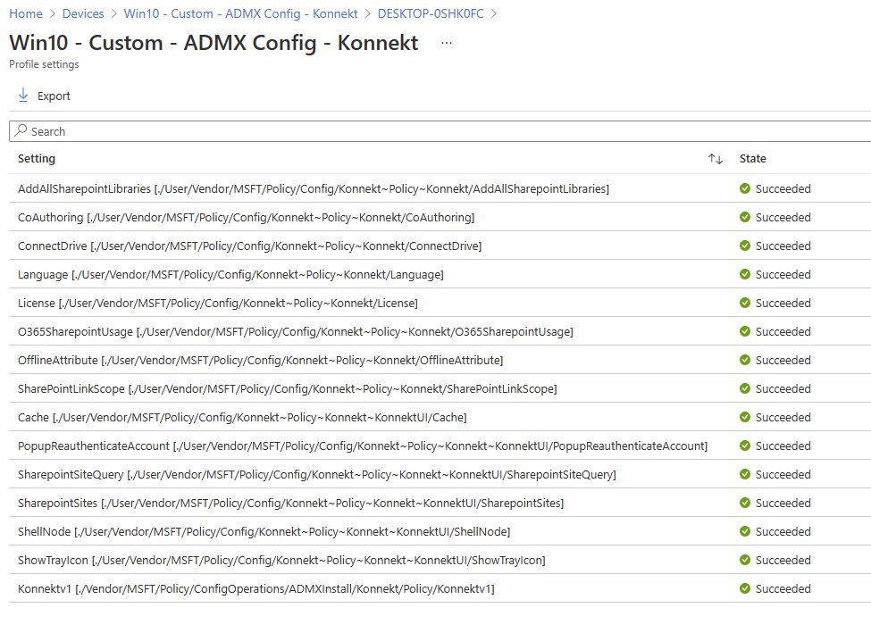
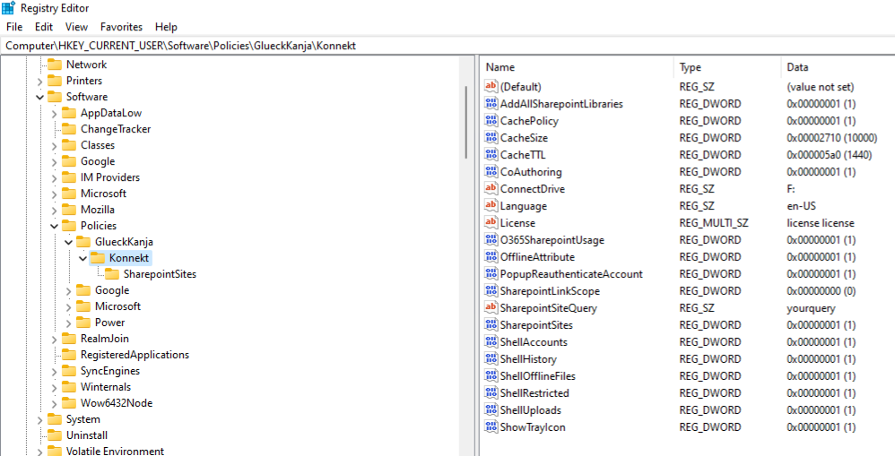

# Settings for Intune managed devices

Starting in Windows 10, version 1703, you can import ADMX files (also called ADMX ingestion) and set those ADMX-backed policies for Win32 and Desktop Bridge apps by using Windows 10 Mobile Device Management (MDM) on desktop SKUs. The ADMX files that define policy information can be ingested to your device by using the Policy CSP URI, The ingested ADMX file is then processed into MDM policies.


For more in information please visit [Understanding ADMX-backed policies](https://docs.microsoft.com/en-us/windows/client-management/mdm/understanding-admx-backed-policies) and [Policy CSP](https://docs.microsoft.com/en-us/windows/client-management/mdm/policy-configuration-service-provider)&#x20;

## Ingesting KONNEKT ADMX file **and deploying policies**

In order to set the KONNEKT policies you need to ingest the admx file in a configuration profile first:

1\. Go to your **Microsoft Endpoint Manager** portal\
2\. Click on **Devices**, then in the sub-menu go to **Configuration profiles**\
****3. **Create profile:** Select Platform **Windows 10 and later,** profile type **Templates,** in search field choose **Custom,** then **Create**


4\. Now choose a **Name** for this profile, **Next**\
****5. Under **Configuration settings:**

**First you have to** ingest the admx file: **Add** new Row

Click on **Add** then in the new window:

* **Name:** choose a name, e.g. KonnektAdmxIngesting
* **OMA-URI:**&#x20;

```
./Vendor/MSFT/Policy/ConfigOperations/ADMXInstall/Konnekt/Policy/KonnektAdmx

```

* **Data type:** String
* **Value:** copy the content of this [admx file](https://firebasestorage.googleapis.com/v0/b/gitbook-28427.appspot.com/o/assets%2F-M8zLVuKYctMIUr68\_fs%2F-M\_QAL1AwCW0cEwatnDl%2F-M\_QCBBYo6kgrK2QQ-pf%2Fadmx-adml.zip?alt=media\&token=ad86d8b4-e2ea-428b-b2e8-14d431fe7521), then **Save**

.png>)

Now add all policies you need to assign to clients from the [Available Intune Policies](setting-for-intune-managed-devices.md#available-intune-policies).


In the following picture 4 policies are added (as an example) after ingesting the admx file, you can choose the policies you need to push to your clients from the tables [Available Intune Policies](setting-for-intune-managed-devices.md#available-intune-policies)&#x20;



6\. Assign the policies to groups/users, and **Next, Next and Create**

****\
****After a successful **** Sync for assigned devices/users restart **KONNEKT** to apply the new policies.

To check that the URI's have been deployed correctly in your MDM go to **Devices -> Windows -> your Device -> Device configuration -> your configuration profile**



To check configured URI's on the machine go to the following path in the Registry:

```
[HKCU or HKLM]\SOFTWARE\Policies\GlueckKanja\Konnekt
```


Choose **HKCU** for user policies or **HKLM** for machine policies.




## Available Intune Policies

In the following table are the URI's and possible values for KONNEKT settings, to deploy them in Intune MDM please [check here](setting-for-intune-managed-devices.md#ingesting-konnekt-admx-file-and-deploying-policies)


URI's are case-sensitive!



Don't forget to choose where the policy should be deployed (Device or User side)


|                 Policy Name                | URI                                                                                                                                     | Data Type |                                                                                                                                         Value                                                                                                                                         |                                      Note                                      |
| :----------------------------------------: | --------------------------------------------------------------------------------------------------------------------------------------- | --------- | :-----------------------------------------------------------------------------------------------------------------------------------------------------------------------------------------------------------------------------------------------------------------------------------: | :----------------------------------------------------------------------------: |
| Automatically add all SharePoint libraries | <p>
<br><mark style="color:blue;">./[Device|User]/Vendor/MSFT/Policy/Config/Konnekt~Policy~Konnekt/AddAllSharepointLibraries</mark></p> | String    |                                                                                                              <mark style="color:blue;">\<enabled/> or \<disabled></mark>                                                                                                              |   Add all additional SharePoint document libraries (besides the default one)   |
|                Co-Authoring                | <mark style="color:blue;">./\[Device\|User]/Vendor/MSFT/Policy/Config/Konnekt\~Policy\~Konnekt/CoAuthoring</mark>                       | String    |                                                                                                               <mark style="color:blue;">\<enabled/> or \<disabled></mark>                                                                                                             |                                                                                |
|             Assign Drive Letter            | <mark style="color:blue;">./\[Device\|User]/Vendor/MSFT/Policy/Config/Konnekt\~Policy\~Konnekt/ConnectDrive</mark>                      | String    |                                                                                                   <mark style="color:blue;">\<enabled/> \<data id="DriveSelect" value="F:"/></mark>                                                                                                   |                              value  from F: to Z:                              |
|                  Language                  | <mark style="color:blue;">./\[Device\|User]/Vendor/MSFT/Policy/Config/Konnekt\~Policy\~Konnekt/Language</mark>                          | String    |                                                                                                <mark style="color:blue;">\<enabled/> \<data id="LanguageSelect" value="en-US"/></mark>                                                                                                |                              value en-US or de-DE                              |
|               Set License Key              | <mark style="color:blue;">./\[Device\|User]/Vendor/MSFT/Policy/Config/Konnekt\~Policy\~Konnekt/License</mark>                           | String    |                                                                                                  <mark style="color:blue;">\<enabled/> \<data id="License" value="your key"/></mark>                                                                                                  |                                                                                |
|              SharePoint Usage              | <mark style="color:blue;">./\[Device\|User]/Vendor/MSFT/Policy/Config/Konnekt\~Policy\~Konnekt/O365SharepointUsage</mark>               | String    |                                                                                                               <mark style="color:blue;">\<enabled/> or \<disabled></mark>                                                                                                             |                      Add SharePoint sites on O365 accounts                     |
|              Offline Attribute             | <mark style="color:blue;">./\[Device\|User]/Vendor/MSFT/Policy/Config/Konnekt\~Policy\~Konnekt/OfflineAttribute</mark>                  | String    |                                                                                                              <mark style="color:blue;">\<enabled/> or \<disabled></mark>                                                                                                              |                        available only for OneDrive sites                       |
|        Default SharePoint link scope       | <mark style="color:blue;">./\[Device\|User]/Vendor/MSFT/Policy/Config/Konnekt\~Policy\~Konnekt/SharePointLinkScope</mark>               | String    | <mark style="color:blue;">\<enabled/> \<data id="SharepointLinkScopeSelect" value="see</mark> <mark style="color:green;"></mark> [<mark style="color:green;">\[1\]</mark>](setting-for-intune-managed-devices.md#1-default-sharepoint-link-scope)<mark style="color:blue;">"/></mark> | [\[1\]](setting-for-intune-managed-devices.md#1-default-sharepoint-link-scope) |


Following policies are applicable to version 2.0 and above


|          Policy Name         | URI                                                                                                                                         | Data Type |                                                                                                                                                                                                                                                                                                                Value                                                                                                                                                                                                                                                                                                               |                                                                                                                                                          Note                                                                                                                                                          |
| :--------------------------: | ------------------------------------------------------------------------------------------------------------------------------------------- | --------- | :--------------------------------------------------------------------------------------------------------------------------------------------------------------------------------------------------------------------------------------------------------------------------------------------------------------------------------------------------------------------------------------------------------------------------------------------------------------------------------------------------------------------------------------------------------------------------------------------------------------------------------: | :--------------------------------------------------------------------------------------------------------------------------------------------------------------------------------------------------------------------------------------------------------------------------------------------------------------------: |
|             Cache            | <mark style="color:blue;">./\[Device\|User]/Vendor/MSFT/Policy/Config/Konnekt\~Policy\~Konnekt\~KonnektUI/Cache</mark>                      | String    | <p><mark style="color:blue;">&#x3C;enabled/></mark><br><mark style="color:blue;">&#x3C;data id="CacheTTL" value="see</mark> <mark style="color:green;"></mark> <a href="setting-for-intune-managed-devices.md#2-cache-this-policy-defines-the-caching-behavior-of-konnekt"><mark style="color:green;">[2]</mark></a><mark style="color:blue;">"/></mark></p><p><mark style="color:blue;">&#x3C;data id="CacheSize" value="see</mark> <a href="setting-for-intune-managed-devices.md#2-cache-this-policy-defines-the-caching-behavior-of-konnekt"><mark style="color:green;">[2]</mark></a><mark style="color:blue;">"/></mark></p> |                                                                                                       [\[2\]](setting-for-intune-managed-devices.md#1-cache-this-policy-defines-the-caching-behavior-of-konnekt)                                                                                                       |
|        Hide Tray Icon        | <mark style="color:blue;">./\[Device\|\[Device\|User]]/Vendor/MSFT/Policy/Config/Konnekt\~Policy\~Konnekt\~KonnektUI/ShowTrayIcon</mark>    | String    |                                                                                                                                                                                                                                                                                     <mark style="color:blue;">\<enabled/> or \<disabled></mark>                                                                                                                                                                                                                                                                                    |                                                                                                                                                                                                                                                                                                                        |
| Account Re-authentication UI | <mark style="color:blue;">./\[Device\|User]/Vendor/MSFT/Policy/Config/Konnekt\~Policy\~Konnekt\~KonnektUI/PopupReauthenticateAccount</mark> | String    |                                                                                                                                                                                                                                                                                     <mark style="color:blue;">\<enabled/> or \<disabled></mark>                                                                                                                                                                                                                                                                                    | [\[3\]](setting-for-intune-managed-devices.md#2-account-re-authentication-ui-this-policy-controls-if-the-login-dialog-pops-up-immediately-if-an-account-needs-to-be-re-authenticated-if-the-policy-is-enabled-the-login-dialog-is-shown-if-the-policy-is-disabled-only-an-error-is-indicated-in-the-tray-and-explorer) |
|     SharePoint Site Query    | <mark style="color:blue;">./\[Device\|User]/Vendor/MSFT/Policy/Config/Konnekt\~Policy\~Konnekt\~KonnektUI/SharepointSiteQuery</mark>        | String    |                                                                                                                                                                                                                                        <p><mark style="color:blue;">&#x3C;enabled/></mark><br><mark style="color:blue;">&#x3C;data id="SharepointSiteQuery" value="your query"/></mark></p>                                                                                                                                                                                                                                        |                                                                                                                         [\[4\]](setting-for-intune-managed-devices.md#4-sharepoint-site-query)                                                                                                                         |
|      Konnekt Explorer UI     | <mark style="color:blue;">./\[Device\|User]/Vendor/MSFT/Policy/Config/Konnekt\~Policy\~Konnekt\~KonnektUI/ShellNode</mark>                  | String    |                                                                                                                                                  <p><mark style="color:blue;">&#x3C;enabled/></mark> <br><mark style="color:blue;">&#x3C;data id="see</mark> <mark style="color:green;"></mark> <a href="setting-for-intune-managed-devices.md#5-konnekt-explorer-ui"><mark style="color:green;">[5]</mark></a><mark style="color:blue;">" value="true/false"/></mark></p><p></p>                                                                                                                                                  |                                                                                                                          [\[5\]](setting-for-intune-managed-devices.md#5-konnekt-explorer-ui)                                                                                                                          |

### \[1] Default SharePoint link scope

Select the default link scope for links created on SharePoint files, value can be:

* **0:** Default company setting
* **1:** Anonymous
* **2:** Organisation
* **3:** Disabled

For more information see [https://github.com/OneDrive/onedrive-api-docs/blob/live/docs/rest-api/api/driveitem\_createlink.md#scope-types](https://github.com/OneDrive/onedrive-api-docs/blob/live/docs/rest-api/api/driveitem\_createlink.md#scope-types)

### **\[2] Cache:** This policy defines the caching behavior of Konnekt

Konnekt uses the cache for different purposes

* Files that are currently open by the user
* Files that need to be uploaded (write cache)
* Files that are closed (read cache)


The maximum value of CacheTTL is **2880** (Time in minutes)

The maximum value of CacheSize is **20000** (Size in megabytes), if zero (0), the cache size will be calculated from free disk space (default)


The cache operates in different pressure states:&#x20;

* **Normal pressure:** The cache is utilized below critical values. Closed files will be kept in the read cache up to the TTL value.
* **High read pressure:** The cache is filled up with too many closed files. The read cache will be deleted. **High write pressure:** The cache is holding lots of files queued for upload. Further write operations will be throttled in order to empty the upload queue.
* **Critical write pressure:** The cache is nearly filled up with files queued for upload. Further write operations will be throttled significantly in order to empty the upload queue.
* **Cache full:** The cache is completely occupied. Requests to open further files will be rejected.


Both need to have a value configured if enabled!


**Example:**

`<enabled/>`\
`<data id="CacheTTL" value="1440"/>`\
`<data id="CacheSize" value="10000"/>`

### &#x20;**\[3] Account Re-authentication UI**

This policy controls if the login dialog pops up immediately if an account needs to be re-authenticated.\
If the policy is enabled, the login dialog is shown. If the policy is disabled, only an error is indicated in the tray and explorer.

### \[4] SharePoint Site Query

This policy controls the query string used to find SharePoint sites.

The site query needs to be expressed in KQL. You can find general KQL documentation here: [https://docs.microsoft.com/en-us/sharepoint/dev/general-development/keyword-query-language-kql-syntax-reference](https://docs.microsoft.com/en-us/sharepoint/dev/general-development/keyword-query-language-kql-syntax-reference)

A list of query properties for SharePoint can be found here: [https://docs.microsoft.com/en-us/sharepoint/technical-reference/crawled-and-managed-properties-overview](https://docs.microsoft.com/en-us/sharepoint/technical-reference/crawled-and-managed-properties-overview)

### &#x20;\[5] Konnekt Explorer UI

This policy defines which components of the Konnekt explorer node are shown and which are not.

Konnekt has 4 components shown in Explorer window: **Uploads**, **History**, **Offline Files,** and **Accounts**


**With the following policy values you can control them:**

`<data id="ShellUploads" value="[true | false]"/>`\
`<data id="ShellHistory" value="[true | false]"/>`\
`<data id="ShellOfflineFiles" value="[true | false]"/>`\
`<data id="ShellAccounts" value="[true | false]"/>`

**Example:** show **Uploads, History** and **Offline Files** and hide **Accounts:**

`<enabled/>`\
****`<data id="ShellUploads" value="true"/>`\
`<data id="ShellHistory" value="true"/>`\
`<data id="ShellOfflineFiles" value="true"/>`\
`<data id="ShellAccounts" value="false"/>`


To get the policy effect you have to restart the **Windows Explorer** process, no need to restart **KONNEKT**


**Result:**


