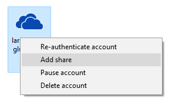

# Additional document libraries

## Add additional document libraries

By default, KONNEKT uses the default document libraries from a SharePoint site. But you can add further document libraries to KONNEKT.

Do the following to add a further document library:

1. Open KONNEKT in the Windows Explorer
2. Click on **Accounts**
3. Right-click on the account
4. Select **Add share**

5\. Enter the document library URL in the dialog which opens then

6\. Choose the right library you want to add

7\. You can change the name of your share. This name will appear in KONNEKT.

Now the document library will be added and is available via the KONNEKT menu in the Windows Explorer.


This feature offers you to add only public libraries, to add a private channel library please check [here ](auto-mapping.md#example-2-add-teams-private-channels-automatically-to-konnekt-explorer-window)


## Remove additional document libraries

A manually added document library can be removed using the following steps:

1. Right-click on the added document library
2. Navigate to **Konnekt**
3. Click **Remove share**

