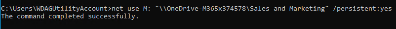

# Assign drive letters

## Assign driver letter to OneDrive for Business library

With this setting, you can configure a drive letter for the OneDrive for Business library.

The default value is `H:`

You can configure this feature with the following options alternatively:

### Preferences menu

.png>)


### GPO/Intune

Please use our [ADMX template](../management-options/settings-via-gpo.md#admx-file) to configure this setting or via Intune management.

Policy name: `Connect drive`

| GPO-setting |                     Value                     | Behavior                                                                                                                                                            |
| :---------: | :-------------------------------------------: | ------------------------------------------------------------------------------------------------------------------------------------------------------------------- |
|   Disabled  |                      N/A                      | KONNEKT will not assign a drive letter to the OneDrive for Business document library. Config item in preferences menu will be disabled for change by user.          |
|    Enable   |                   "Disabled"                  | KONNEKT will not assign a drive letter to the OneDrive for Business document library. Config item in preferences menu will be disabled for change by user.          |
|    Enable   | <p>&#x3C;drive-letter>:</p><p>(e.g. "H:")</p> | KONNEKT will assign the configured drive letter to the OneDrive for Business document library. Config item in preferences menu will be disabled for change by user. |

### Registry

**Key name:** `ConnectDrive`\
**Key type:** REG\_SZ (String Value)\
**Storage locations:**

* `HKEY_CURRENT_USER\SOFTWARE\Policies\GlueckKanja\Konnekt`
* `HKEY_LOCAL_MACHINE\SOFTWARE\Policies\GlueckKanja\Konnekt`

## Assign drive letters to other folders using "net use"

You can assign a drive letter to a KONNEKT folder, by using the _`net use`_ command.

**Usage**

```
net use <DRIVE-LETTER>: <KONNEKT-UNC-PATH> [/PERSISTENT:{YES | NO}]
```

&#x20;For more information on the _`net use`_ command see [here](https://ss64.com/nt/net-use.html), or run `net use /?` in your command prompt.


**Note:** if the name of Folder contains spaces you have to but the UNC-Path in " " like in the next example.


&#x20;**Example:**



**Result:**


## Assign drive letters with Managed Mappings

You can map drive letters to sites and libraries with [Managed Mappings](administrative-mappings.md).
