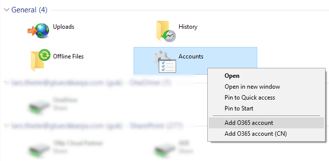

# Multi-tenant configuration

With KONNEKT it is possible to work with multiple tenants simultaneously. Just open the Windows Explorer with KONNEKT selected on the left pane and right-click on **Accounts**:

Log in with the account for the tenant you want to add.
