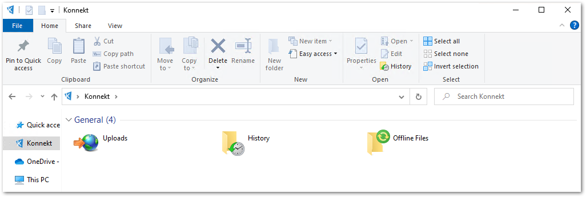

# Intune GUI settings


Most of the policies are applicable to version 2.0 and above


## Language

**Name:** Konnekt-Language

**OMA-URI**

User context:

```
./User/Vendor/MSFT/Policy/Config/Konnekt~Policy~Konnekt~ExplorerUI/Language
```

Device context:

```
./Device/Vendor/MSFT/Policy/Config/Konnekt~Policy~Konnekt~ExplorerUI/Language
```

**Data type:** String

**Value**&#x20;

```
<enabled/>
<data id="LanguageSelect" value="en-US"/>
```

**Note**

As value use `en-US` for English or `de-DE`for German

## Account re-authentication UI

**Name:** Konnekt-Account-re-authentication-UI

**OMA-URI**

User context:

```
./User/Vendor/MSFT/Policy/Config/Konnekt~Policy~Konnekt~ExplorerUI/PopupReauthenticateAccount
```

Device context:

```
./Device/Vendor/MSFT/Policy/Config/Konnekt~Policy~Konnekt~ExplorerUI/PopupReauthenticateAccount
```

**Data type:** String

**Value options**

```
<enabled/>
```

```
<disabled/>
```

**Note**

For more information about the policy, see [Account re-authentication](../../gui-behavior/account-reauthentication.md)

## Konnekt Explorer UI

**Name:** Konnekt-Explorer-UI

**OMA-URI**

User context:

```
./User/Vendor/MSFT/Policy/Config/Konnekt~Policy~Konnekt~ExplorerUI/ShellNode
```

Device context:

```
./Device/Vendor/MSFT/Policy/Config/Konnekt~Policy~Konnekt~ExplorerUI/ShellNode
```

**Value**

```
<enabled/> 
<data id="ShellUploads" value="true"/>
<data id="ShellHistory" value="true"/>
<data id="ShellOfflineFiles" value="true"/>
<data id="ShellAccounts" value="true"/>
```

**Note**

To hide one (or more) component, change the value to `false`. For more information about the policy, see [Explorer UI](../../gui-behavior/konnekt-explorer-ui.md)

#### **Example:**

Show **Uploads, History,** and **Offline Files** and hide **Account**

```
<enabled/>
<data id="ShellUploads" value="true"/>
<data id="ShellHistory" value="true"/>
<data id="ShellOfflineFiles" value="true"/>
<data id="ShellAccounts" value="false"/>
```

#### **Result**



## Tray icon

Name: Konnekt-Tray-Icon

**OMA-URI**

User context:

```
./User/Vendor/MSFT/Policy/Config/Konnekt~Policy~Konnekt~ExplorerUI/ShowTrayIcon
```

Device context:

```
./Device/Vendor/MSFT/Policy/Config/Konnekt~Policy~Konnekt~ExplorerUI/ShowTrayIcon
```

**Value options**

```
<enabled/>
```

```
<disabled/>
```

**Note**

For more information about the policy, see [Hide tray icon](../../gui-behavior/hide-tray-icon.md)
