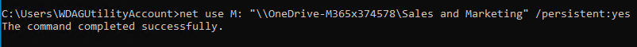

# Assign drive letters

## Assign driver letter to OneDrive for Business library

With this setting, you can configure a drive letter for the OneDrive for Business library.

The default value is `H:`

You can configure this feature with the following options alternatively:

### Preferences menu


### GPO/Intune

Please use our [ADMX template](../management-options/#admx-adml-files) to configure this setting or via Intune management.

Policy name: `Connect drive`


After applying the policy, restarting the machine is required


#### KONNEKT 2.6.0 and newer:

| Policy-setting |                     Value                     | Behavior                                                                                                                                                                                 |
| :------------: | :-------------------------------------------: | ---------------------------------------------------------------------------------------------------------------------------------------------------------------------------------------- |
| Not configured |                      N/A                      | <p>KONNEKT will assign H: to the OneDrive for Business document library by default. <br>User can change the setting in the preferences menu.<br>OneDrive is mapped to H: by default.</p> |
|    Disabled    |                      N/A                      | <p>KONNEKT will not assign any drive letter to the OneDrive for Business document library. <br>User can not change the setting in the preferences menu.</p>                              |
|     Enabled    | <p>&#x3C;drive-letter>:</p><p>(e.g. "H:")</p> | <p>KONNEKT will assign the configured drive letter to the OneDrive for Business document library. <br>User can not change the setting in the preferences menu.</p>                       |

#### KONNEKT older than 2.6.0

| Policy-setting |                     Value                     | Behavior                                                                                                                                                                                                                                                                                  |
| :------------: | :-------------------------------------------: | ----------------------------------------------------------------------------------------------------------------------------------------------------------------------------------------------------------------------------------------------------------------------------------------- |
| Not configured |                      N/A                      | <p>KONNEKT will assign H: to the OneDrive for Business document library by default. <br>User can change the setting in the preferences menu.<br>OneDrive is mapped to H: by default.</p>                                                                                                  |
|    Disabled    |                      N/A                      | KONNEKT will assign and map the default drive letter! To disable drive mappings to the OneDrive for Business document library, you should enable the policy and set the **Drive** under **Options** to **Disabled.** Config item in preferences menu will be disabled for change by user. |
|     Enable     |                   "Disabled"                  | KONNEKT will not assign a drive letter to the OneDrive for Business document library. Config item in preferences menu will be disabled for change by user.                                                                                                                                |
|     Enable     | <p>&#x3C;drive-letter>:</p><p>(e.g. "H:")</p> | KONNEKT will assign the configured drive letter to the OneDrive for Business document library. Config item in preferences menu will be disabled for change by user.                                                                                                                       |

### Registry

**Key name:** `ConnectDrive`\
**Key type:** REG\_SZ (String Value)

## Assign drive letters to other folders using "net use"

You can assign a drive letter to a KONNEKT folder, by using the _`net use`_ command.

**Usage**

```
net use <DRIVE-LETTER>: <KONNEKT-UNC-PATH> [/PERSISTENT:{YES | NO}]
```

For more information on the _`net use`_ command see [here](https://ss64.com/nt/net-use.html), or run `net use /?` in your command prompt.


Make sure to run CMD without admin rights to avoid any connecting errors for normal users.



**Note:** if the name of Folder contains spaces you have to but the UNC-Path in " " like in the next example.


&#x20;**Example:**



**Result:**


## Assign drive letters with Managed Mappings

You can map drive letters to sites and libraries with [Managed Mappings](administrative-mappings.md).

## **There are several ways to apply the policy:**

* manually by adding the key in the registry under machine or user registry settings
* via GPO, see [settings via GPO](../management-options/settings-via-gpo.md)
* pushing policies via Intune, see [settings for Intune Managed Devices](../management-options/setting-for-intune-managed-devices-1/intune-mappings.md#connect-drive)

**Policies** stored in:

`HKEY_CURRENT_USER\SOFTWARE\Policies\GlueckKanja\Konnekt`

`HKEY_LOCAL_MACHINE\SOFTWARE\Policies\GlueckKanja\Konnekt`
