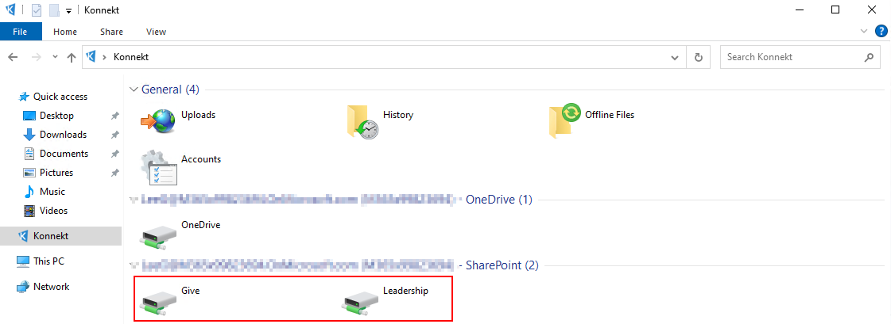

# Auto mapping

Auto Mapping is the feature of KONNEKT, that automatically maps all SharePoint Online sites & document libraries into the users Windows File Explorer (and other file dialogues). Only sites & libraries, the user has access to, are mapped.

Administrators can control this feature on two levels:

1. Site level
2. Library level

KONNEKT updates the mappings every 60 minutes.


KONNEKT uses SharePoint Online Search's default 'Result Source.' Modifying this setting could alter the Site Collections and Document Libraries displayed.


## Site scope


This policy is applicable to version 2.0 and above



By default KONNEKT will map all team and communication sites and subsites the user has access to. Private channels of Teams are not in the default site scope.

**If you are fine with that, you do not need to use this policy.**


### **Policy** Definition

* **Policy Name (ADMX):** `Sharepoint Sites Query`

This policy enables you to define the query string used to find SharePoint sites.

The site query needs to be expressed in KQL. You can find general KQL documentation here: [https://docs.microsoft.com/en-us/sharepoint/dev/general-development/keyword-query-language-kql-syntax-reference](https://docs.microsoft.com/en-us/sharepoint/dev/general-development/keyword-query-language-kql-syntax-reference)

A list of query properties for SharePoint can be found here: [https://docs.microsoft.com/en-us/sharepoint/technical-reference/crawled-and-managed-properties-overview](https://docs.microsoft.com/en-us/sharepoint/technical-reference/crawled-and-managed-properties-overview)

You can test your KQL site query at this SharePoint Online URL:

```
https://<YourTenantName>.sharepoint.com/_layouts/15/osssearchresults.aspx
```

In the following paragraphs, you can find some examples for KQL query strings.

### Default

If you do not configure this policy, KONNEKT will use the following default KQL query:

```
(webtemplate:STS OR webtemplate:GROUP OR webtemplate:SITEPAGEPUBLISHING) AND (contentclass=STS_Site OR contentclass=STS_Web)
```

This will map all team and communication sites, the user has access to. Private channels of Teams are not in the default site scope


### Examples

#### Sites whitelisting

<details>

<summary>Filter on site name/title</summary>

`Title="<MySiteName>"`

**Query String** to map only the sites "Give" and "Leadership"

```
(webtemplate:STS OR webtemplate:GROUP OR webtemplate:SITEPAGEPUBLISHING) AND (contentclass=STS_Site OR contentclass=STS_Web) AND (title="Give" OR title="Leadership")
```

**Note:** restarting KONNEKT is required to apply the policy

</details>




**Note:** To show all sites with \<Leadership> in the name, use the operator **(:)** instead of **(=)** by title


#### Sites whitelisting using \* operator

<details>

<summary>Filter on site name/title using (*) operator</summary>

Show all sites has a word starting with Con `title:<"Con*">`

**Query string**

```
(webtemplate:STS OR webtemplate:GROUP OR webtemplate:SITEPAGEPUBLISHING) AND (contentclass=STS_Site OR contentclass=STS_Web) AND (title:"Con*")
```

</details>


**Note**: We do not recommend combining the **(=)** operator together with asterisk **(\*)** when you do exact matching. Instead, use the **(:)** operator with **(\*)**


#### Sites blacklisting

<details>

<summary>Exclude sites per site name/title</summary>

Map all sites and libraries except specific sites (and their libraries)

**Query string** to exclude `<Site01>` and `<Site02>`

```
(webtemplate:STS OR webtemplate:GROUP OR webtemplate:SITEPAGEPUBLISHING) AND (NOT (sitetitle:"Site01" OR sitetitle:"Site02"))
```

**Note:** restarting KONNEKT is required to apply the policy

</details>

#### Teams private and shared channels

<details>

<summary>Add Microsoft Teams private and shared channels</summary>

Map all SP sites, Teams private channels and Teams shared channels&#x20;

By adding `webtemplate:TEAMCHANNEL` to the query

**Query string**

```
(webtemplate:STS OR webtemplate:GROUP OR webtemplate:SITEPAGEPUBLISHING OR webtemplate:TEAMCHANNEL) AND (contentclass=STS_Site OR contentclass=STS_Web)
```

**Note:** restarting KONNEKT is required to apply the policy

Since private and shared channels are dedicated sites on SharePoint, they appear as dedicated volumes in KONNEKT.

</details>

#### All Subsites for multiple SharePoint sites

<details>

<summary>Show all Subsites of one or more SharePoint sites</summary>

To map all Subsites (and Libraries) of one or more SharePoint sites, you can use the following query

**Query string**

```
(webtemplate:STS OR webtemplate:GROUP OR webtemplate:SITEPAGEPUBLISHING) AND (contentclass=STS_Site OR contentclass=STS_Web) AND (path:https://c4a8ehamed.sharepoint.com/sites/MySite1 OR path:https://c4a8ehamed.sharepoint.com/sites/MySite2)
```

**Note:** change MySite1 and MySite2 to your SharePoint site names.&#x20;

You map Subsites and libraries of only  one SharePoint site or even add multiple URLs if needed

</details>

### **There are several ways to apply the policy:**

* manually by adding the key in the registry under machine or user registry settings
* via GPO, [check settings via GPO](../management-options/settings-via-gpo.md)
* pushing policies via Intune, see [settings for Intune Managed Devices](../management-options/setting-for-intune-managed-devices-1/intune-mappings.md#sharepoint-site-query)

#### **Manual setting in the registry**


You do not need this if you use GPO or Intune management.


* **Registry Value name:** `SharepointSiteQuery`
* **Registry Value type:** `REG_SZ`
* **Registry Value data:** KQL string
* **Registry Value storage location**:
  * `HKEY_CURRENT_USER\SOFTWARE\Policies\GlueckKanja\Konnekt`\
    or
  * `HKEY_LOCAL_MACHINE\SOFTWARE\Policies\GlueckKanja\Konnekt`

## Library scope

### Map default document libraries

If enabled this setting will display all default libraries from all Site Collections where a user has access to.

A user can set this setting via the preferences menu:


It can be configured via registry/GPO/MDM as well:

**Policy Name (ADMX):** Sharepoint Sites Autodiscovery


#### Registry

Key name: **O365SharepointUsage**\
Key type: REG\_DWORD

Enable or disable access to SharePoint Online sites.

| Function |           Value          | Behavior                                                                                                                          |
| :------: | :----------------------: | --------------------------------------------------------------------------------------------------------------------------------- |
|  Disable |             0            | KONNEKT maps the OneDrive for Business library, only.                                                                             |
|  Enable  | <p>1</p><p>(default)</p> | KONNEKT maps the OneDrive for Business and all default document libraries of the SharePoint Online sites, the user has access to. |

The default value is 1 (enable).

We recommend using our [ADMX template](../management-options/settings-via-gpo.md#admx-file) to configure this setting.

### Map all document libraries

You can find this setting in the preferences menu:



Please make sure to reboot **KONNEKT** after changing this setting.


You can also configure this setting via registry/GPO/MDM:

**Policy Name (ADMX):** Add all sharepoint libraries


#### Registry

Key name: **AddAllSharepointLibraries**\
Type: REG\_DWORD

| Function |           Value          | Behavior                                                                                                                                                                                                     |
| :------: | :----------------------: | ------------------------------------------------------------------------------------------------------------------------------------------------------------------------------------------------------------ |
|  Disable | <p>0</p><p>(default)</p> | <p>KONNEKT will map the default document library of the SharePoint Online sites, only.</p><p>Format of the UNC addressing is: <br><code>\\OneDrive-&#x3C;tenant-name>\&#x3C;site-name>\...</code></p>        |
|  Enable  |             1            | <p>KONNEKT will map all document libraries of the SharePoint Online site.</p><p>Format of the UNC addressing is: <br><code>\\OneDrive-&#x3C;tenant-name>\&#x3C;site-name>\&#x3C;library-name>\...</code></p> |

The default value is 0 (disable)


If users in your company are using different values of this setting, their UNC paths will not be compatible with each other (e.g. when they exchange UNC links).

To prevent this, ensure that this setting is set for all users correctly.


We recommend using our [ADMX template](../management-options/settings-via-gpo.md#admx-file) to configure this setting.

## **There are several ways to apply the policy:**

* manually by adding the key in the registry under machine or user registry settings
* via GPO, see [settings via GPO](../management-options/settings-via-gpo.md)
* pushing policies via Intune, see [settings for Intune Managed Devices](../management-options/setting-for-intune-managed-devices-1/intune-mappings.md#add-sharepoint-libraries)
