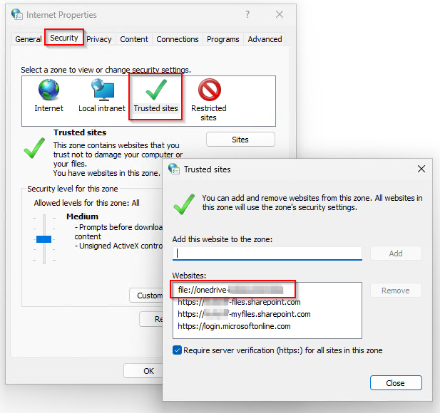

# Enhanced Authentication

Enhanced Authentication enables KONNEKT to use improved [OAuth 2.0 authorization](https://learn.microsoft.com/en-us/entra/identity-platform/v2-oauth2-auth-code-flow#protocol-details).

This solves an long standing issue with excluded apps.


By enabling this setting:

* A new Azure app registration is required
* Users need to reauthenticate!
* Tenant name will be changed to the default name



This policy is applicable to KONNEKT version 2.10 and above.


To enable this setting, it needs to be set tenant wide with that setting. While enabling this setting Azure will prompt a new App registration.

<figure><figcaption></figcaption></figure>

####

### Policy

Policy Name: Enhanced OAuth

Possible values: Can be enabled or disabled.&#x20;

The default value is disabled.

We recommend to use our [ADMX template](../management-options/settings-via-gpo.md#admx-file) to configure this setting. You will find the policy in "System settings" in GPO editor.

### Registry

Key name: EnhancedOAuth

Type: REG\_DWORD

| Function |           Value          | Behavior                                            |
| :------: | :----------------------: | --------------------------------------------------- |
|  Disable | 
0

(default)
 | KONNEKT will use the traditional OAuth2 procedures. |
|  Enable  |             1            | KONNEKT will use the improved OAuth 2.0 code.       |

The default value is 0 (disable).


We recommend using our latest ADMX template to configure this setting.

