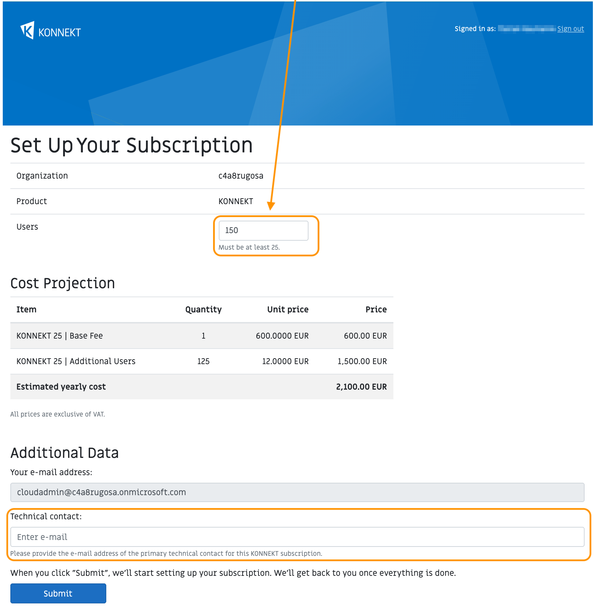

# Azure Marketplace

## Prerequisites 

In order to purchase solutions from independent software vendors (ISV) such as KONNEKT, you must fulfil the following requirements:

1. You have an active Azure subscription.
2. The account you want to purchase our solution with must have the **Owner** or **Contributor** role assigned on the Azure subscription you are going to pay with.
3. The billing account linked to your Azure subscription is properly set up. Depending on your billing account type (Microsoft Customer Agreement or Enterprise Agreement), you might need to enable marketplace purchases in the Azure portal first.

## Pricing Model

* KONNEKT is offered as an **annual subscription plan** with different [User Segments](azure-marketplace.md#user-segments). The correct **user segment** is automatically selected by our platform based on the amount of desired users.
* The annual subscription plan consists of a **base fee** which includes a certain amount of users per year - depending on the **user segment**. For example, the **base fee** for the user segment _KONNEKT 25_ includes 25 users per year.
* If more than the included amount of users is required, **additional users** can be added to the  plan. For each additional user, we charge an additional annual per-user fee.

## Invoicing

* During the first subscription interval, your subscription fees are not immediately due after completing the subscription enrolment. Instead we will start billing once your cancellation grace period has expired.&#x20;
* Upon every renewal date, you will be billed immediately.
* You will always be billed for the entire subscription cycle in advance.
* The related items should appear on your Microsoft Azure invoice (Pay-As-You-Go) the month after we have reported your fees to Microsoft.
*   In the PDF invoice you will receive from Microsoft, all KONNEKT fees are lumped into an item called "SaaS". The related Publisher is "glueckkanja".\

    <figure><figcaption></figcaption></figure>


For a more detailed cost breakdown of your base and additional user fees, please refer to the invoice in your Azure portal.


## Plan Overview

Subscriptions for KONNEKT are available based on an annual renewal interval.

| **Plan** | **Renewal Interval** |
| -------- | -------------------- |
| KONNEKT  | Annually             |

### User Segments

The following user segments are available.

<table data-header-hidden><thead><tr><th width="240.02162801098973">Plan</th><th width="244.07580174927114">Included Users</th><th></th></tr></thead><tbody><tr><td><strong>User Segment</strong></td><td><strong>Included Users in Base Fee</strong></td><td><strong>Maximum Total Users</strong></td></tr><tr><td>KONNEKT 25</td><td>25</td><td>249</td></tr><tr><td>KONNEKT 250</td><td>250</td><td>999</td></tr><tr><td>KONNEKT 1000</td><td>1,000</td><td>4,999</td></tr><tr><td>KONNEKT 5000</td><td>5,000</td><td>9,999</td></tr><tr><td>KONNEKT 10000</td><td>10,000</td><td>unlimited</td></tr></tbody></table>

For prices in Euro (EUR), please check out our [website](https://www.konnekt.io/pricing/). For prices in _your_ currency, please directly refer to the **Marketplace** in the [Azure Portal](https://portal.azure.com/).

## Subscription Management

### User Upgrades

* If you would like to upgrade your user count, you can do that any time during the current subscription cycle by navigating to your **KONNEKT subscription** in the [Azure SaaS portal](https://portal.azure.com/#blade/HubsExtension/BrowseResourceBlade/resourceType/Microsoft.SaaS%2Fresources) and by clicking "Open SaaS Account on publisher's site" (see screenshot below). This will re-direct you to our platform where the amount of users can be upgraded.

* Our platform will inform you about the new fees you to expect for a **complete** subscription cycle.
* For the current cycle, we will bill the additional users for remaining days only.
* After confirming your choice and once we have updated the license in our backend, you will receive a confirmation email from us.

### User Downgrades

* Downgrading the amount of users is currently not possible without cancelling the subscription.
* If you want to perform a downgrade, please [cancel](azure-marketplace.md#cancellation) your current subscription and re-subscribe with the desired amount of users once the cancellation becomes effective.

### Change Plan


This is currently **not supported**. Please [contact us](https://www.konnekt.io/help/) in case you have questions around this topic.


### **Recurring Billing**

If you decide to disable **Recurring billing**, your subscription will not renew automatically. Instead, Microsoft will (irreversibly) cancel the subscription towards the end of the current subscription cycle. This means, the service will be terminated automatically on that date as well. While the subscription has not expired yet, you can opt to enable **Recurring billing** at any time.

### Cancellation

* If you would like to (irreversibly) cancel your subscription, navigate to your **KONNEKT subscription** in the [Azure SaaS portal](https://portal.azure.com/#blade/HubsExtension/BrowseResourceBlade/resourceType/Microsoft.SaaS%2Fresources) and click **Cancel subscription**.

* If you cancel within the grace period, the service will be stopped immediately.
* If you cancel after the grace period, the service will remain active until the end of the current subscription cycle.

## Trials

In case you would like to test KONNEKT, please [get in contact with us](https://www.konnekt.io/start-now/#try) or send us an email to [sales@konnekt.io](mailto:sales@konnekt.io).

## FAQs

### How to purchase KONNEKT?

To get started with your KONNEKT subscription, follow below steps:

* Locate [KONNEKT](https://portal.azure.com/#view/Microsoft_Azure_Marketplace/GalleryItemDetailsBladeNopdl/id/glueckkanja-gabag.konnekt-transactable-prod) on the **Marketplace** in your **Azure Portal**. In case we have extended a **Private Offer** to you or your MSP/distribution has extended a **Multiparty Offer (MPO)** to you, navigate to **Marketplace** in your **Azure Portal** and then to **Private Offer Management** to locate the Private Offer.
  * More details on Private Offers and MPOs can be found in Microsoft's documentation.
    * [Private Offer](https://learn.microsoft.com/en-us/marketplace/private-offers-purchase)
    * [Multiparty Offer](https://www.youtube.com/watch?v=TANUlgLuVqI)
* Click **Subscribe**.

.png>)

* Create or select the **Resource group** you would like to deploy the subscription to.
* Assign a descriptive **Name** to later identify your subscription.
* We recommend to keep **Recurring billing** **On** so that you do not have to worry about an automatic termination of your subscription.
* Click **Review + subscribe** and then **Subscribe** to deploy the **SaaS** resource to your **Resource group**.

.png>)


The random order of **Base Fees** und **Additional Users** under the **Price** information is attributed to limitations of the Azure Marketplace. Later during the the enrolment process, we will provide you with transparent information on the expected licensing costs.


* Once the deployment is complete, please navigate to our platform by clicking **Configure account now**.

.png>)

* After authenticating on our platform using your Microsoft credentials, you will be prompted for additional information, such as the desired total **User** amount and a T**echnical contact**.


The **Technical contact** must have a mailbox connected to it, so we are able to notify you in case there are relevant issues with KONNEKT.


* Based on the amount of users provided, we will charge the relevant base fee for your user segment as well as additional users, in case you require more than the included amount in your base fee. **The platform automatically selects the best price / tier**.
* The platform will show you the licensing fees you have to expect under **Cost Projection**.
* If you are happy with it, please click **Review & Submit** for a final review and a fee summary.
* Complete the checkout by confirming your choice and clicking **Submit**.
* If you are happy with it, please complete the enrolment by clicking S**ubmit**, which triggers us to generate a license key for KONNEKT. You will receive this key as part of our welcome email including all relevant information on the next steps (e.g. how to install KONNEKT on your clients). This won't take any longer than one business day.


You will only be charged by Microsoft, once you have completed the enrolment on our landing page and received our welcome email.


### Why is my Azure Marketplace purchase not working?

You may encounter problems when purchasing through Azure Marketplace. Here is a list of reasons, why buying through Azure Marketplace may fail:

1. You do not have permissions in your Azure tenant to purchase through Azure Marketplace. You must be assigned the role of Owner or Contributor in the Azure subscription you want to pay with.
2. The subscription belongs to an Enterprise Agreement (EA) and the EA admin disabled Azure Marketplace purchases. Or the EA admin has enabled purchases only for free offers and the offer is a paid offer. Please see [here](https://learn.microsoft.com/en-us/marketplace/purchase-control-options) for details.
3.  The subscription you're using belongs to a billing account in a region where the offer isn't available.\
    Our Marketplace offers are available in the following countries/regions:

    Armenia, Australia, Austria, Bulgaria, Belgium, Canada, Chile, Colombia, Croatia, Cyprus, Czechia, Denmark, Estonia, Finland, France, Germany, Greece, Hungary, Iceland, India, Indonesia, Ireland, Italy, Kenya, Latvia, Liechtenstein, Lithuania, Luxembourg, Malaysia, Malta, Monaco, Netherlands, New Zealand, Nigeria, Norway, Poland, Portugal, Puerto Rico, Romania, Saudi Arabia, Serbia, Singapore, Slovakia, Slovenia, South Africa, South Korea, Spain, Sweden, Switzerland, Taiwan, Thailand, Türkiye, United Arab Emirates, United Kingdom, United States, Vietnam
4. The subscription/billing account isn't associated with a valid payment instrument (such as a valid credit card).
5. Private Marketplace is enabled for the subscription and the offer isn't in the list of allowed offers.
6. Purchases are not permitted for subscriptions with a spending cap, including Free subscriptions, Sponsorships, and similar types.
