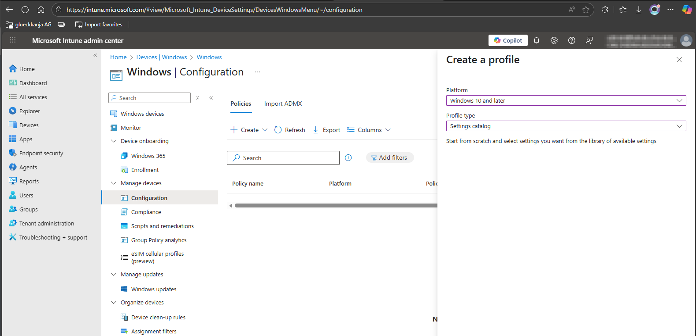

# Add KONNEKT paths as Trusted sites

## Situation

Users cannot open files e.g. Excel macro files by double clicking on it in KONNEKT.

## Problem

&#x20;All SharePoint URLs and the corresponding UNC path used in KONNEKT need to be set as trusted sites

## Solution

These can be set in:

* Internet options in Edge or Internet Explorer (for Windows 10 users)
* Trust Center in an Office app of your choice
* Or via an Intune policy

### Intune

* Create new profile for "Windows 10 and later"
* Profile type "Settings catalog"

<figure><figcaption></figcaption></figure>

* Search for "security pages"
* Select the following category&#x20;
  \


```
Windows Components > Internet Explorer > Internet Control Panel > Security Page
```

* Use either&#x20;
  * Site to Zone Assignment List
  * Site to Zone Assignment List (User)

<figure><figcaption></figcaption></figure>

* Set all three paths - UNC and URL

<figure><figcaption></figcaption></figure>

```
"<TenantName>.sharepoint.com"      = "2",
"<TenantName>-my.sharepoint.com"   = "2",
"\\OneDrive-<TenantName>" = "2"​
```



TenantName is defined by the initial or the default tenant name set in[ Microsoft's Admin Center](https://admin.cloud.microsoft/?#/Domains). This depends if "[EnhancedAuthentication](../configuration/system-settings/enhanced-authentication.md)" is enabled.&#x20;


Setting this up won't pretend Outlook from displaying a Security notice.

<figure><figcaption></figcaption></figure>


For instructions on how to turn off this dialog, refer to the article [_Enable or Disable Hyperlink Warning Messages in Office Programs_](https://learn.microsoft.com/en-us/troubleshoot/microsoft-365-apps/office-suite-issues/enable-disable-hyperlink-warning#how-to-globally-enable-or-disable-hyperlink-warnings).

HKEY\_CURRENT\_USER\software\policies\microsoft\office\16.0\common\security\
DWORD: DisableHyperlinkWarning\
Value: 1


This workaround makes a computer or a network more vulnerable to attack by malicious users or by malicious software such as viruses.

