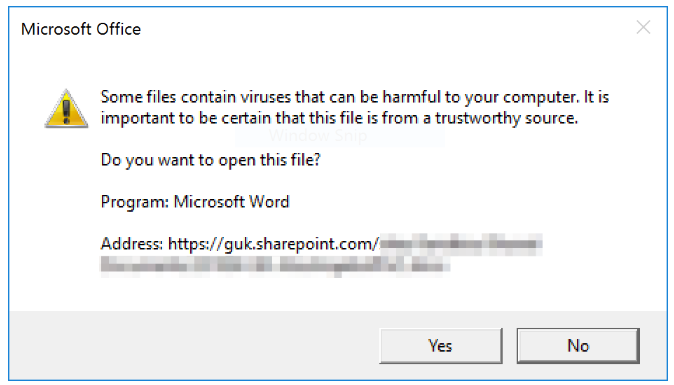

# Opening MS Office documents display a warning message

You might see this error message when KONNEKT **Office Co-Authoring** is enabled.

## **Background**

The issue behind this warning is the restrictions of Microsoft site zones.&#x20;

## **Solution 1**

To prevent this warning, you need to add the server shown in the error message to the **Trusted Sites** **Zone** in the Internet Explorer setting.

## **Solution 2**

* Open either Word, Excel or PowerPoint on the desktop
* Select **File**
* Select **Options**
* Select **Trust Center**
* Select **Trust Center Settings**
* Select **Trusted Locations**
* Select **Add New Location...**
* Add the shown domain of your practice's OneDrive
* Checkmark "**Sub folders of this location are also trusted**"
* Click **OK** to save.

## **Solution 3**

You can disable the Co-Authoring in **KONNEKT:**

* if it is enabled by right clicking on the **KONNEKT** tray icon
* Then click **Preferences**
* Disable the check box for **Office Co-Authoring**
