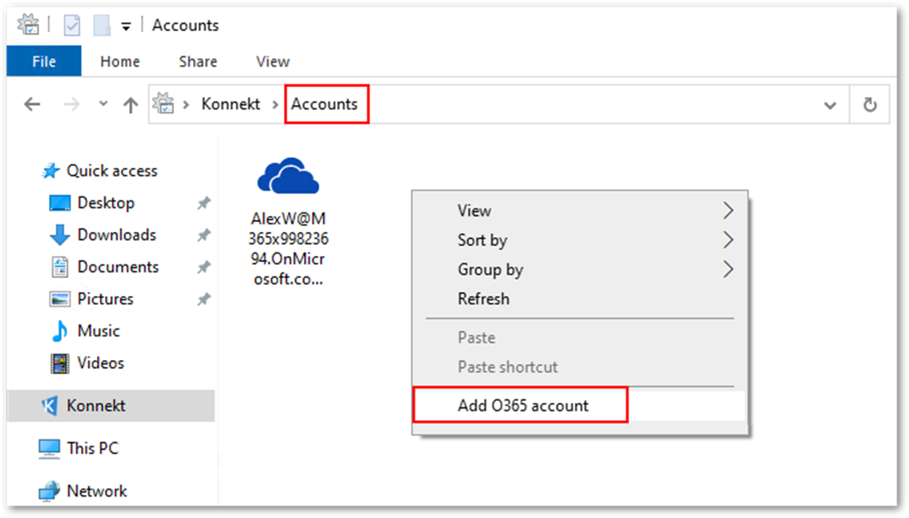

# Configure Office 365 account

KONNEKT leverages the user's Azure AD account to access SharePoint Online.

## Single Sign On (SSO)

If your system is configured for single sign on (SSO) with Azure AD, KONNEKT will automatically setup your account.

## Manual Account Configuration

If your system is not configured for single sign on (SSO) with Azure AD, KONNEKT will open a dialog, to setup the Office 365 / Azure AD account:

Click on "Connect your Office 365 Account".

KONNEKT will open the Microsoft Azure AD sign in page:

Sign in with your Azure AD account.

## Autologon Mapping

After the successful setup of the Office 365 account, KONNEKT will start to search for SharePoint Online sites in the corresponding tenant, the user has access to. KONNEKT will automatically map the default document libraries of those sites in the Windows File Explorer.

If needed, libraries can be mapped to a specific driver letter (see [Assign drive letter to a KONNEKT folder](../configuration/mappings/assign-drive-letters.md)).

If additional SharePoint Online environments are to be accessed under other Azure Active Directory identities/tenants.

## Multi-Tenant Configuration

With KONNEKT it is possible to work with multiple tenants simultaneously. Just open the Windows Explorer with KONNEKT selected on the left pane and right-click on **Accounts**

<figure><figcaption></figcaption></figure>

Log in with the account for the tenant you want to add.

