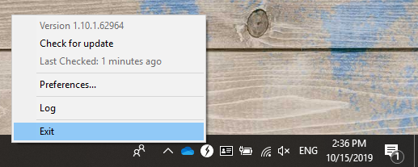

# Debug log preparation

Our support team may ask you to provide debug logs to analyze issues. To do so, please follow these steps:

### **Set Log-Level to Debug:**

Right-Click on the KONNEKT Tray Icon and choose "Preferences"\
\


Set Log-Level to "Debug":


### Exit KONNEKT from the Tray Icon: 



### Restart KONNEKT:

The easiest way to start KONNEKT is to just open Windows Explorer and Click on KONNEKT


### Try reproduce the Issue

Try to reproduce whatever the problem is. Give it some time.

### Download and run the following batch file:



### Find the files and send them to our engineering team

You'll find the collected files in:

```
%UserProfile%\KONNEKT
```

.png>)

Please select all files, zip them and send the zip file to our support.

##
