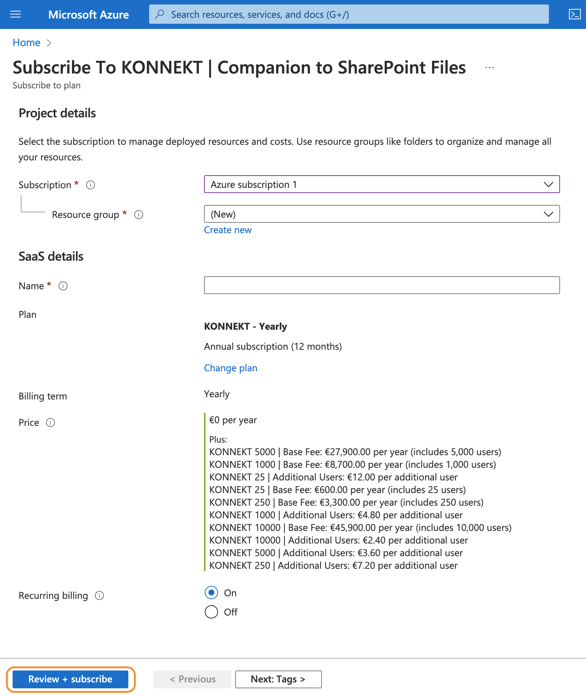

# Delay when opening Windows File Explorer

## Affected KONNEKT releases

* 2.5.0 or newer

## Problem

When opening Windows File Explorer (WFE) or a WFE based save/open dialog from an app, delays of >10 seconds may occur.

## Cause

When WFE starts it accesses all resources linked in the Quick Access pane in WFE.

The delay is mainly caused by links, that are on sub-folder level. Each link consumes \~5 seconds of loading time. Links that point to the volume do not cause a relevant delay.

## Workaround

### Option 1: Delete Quick Access links

Remove Quick Access links, that point to KONNEKT resources on sub-folder level.&#x20;

We recommend to use the Favorites feature of KONNEKT, instead. To use is, just do a right click on a resource, that you want to see a s a favorite under the KONNEKT node, and chose "Add Favorite".

.png>)

### Option 2: Downgrade to KONNEKT 2.2.1

KONNEKT releases prior 2.5.0 use a different discovery strategy.

We recommend to downgrade to [KONNEKT 2.2.1](../changelog.md#2.2.1-2022-12-30-bugfix-release-for-konnekt-2.2.0), if Option 1 is not feasible for you.

## Solution

We are working on a solution to solve this issue.

##
