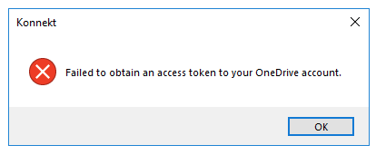

# Error message about missing token

If you see an error regarding a missing token (like the one below) please re-check the consent for **KONNEKT**.

You can consent **KONNEKT** permissions in two ways:

**1-** Directly after the installation, a Microsoft Pop-up window shows up, log on with an azure admin account (or one account has a role that allows granting admin consent), check the option **"Consent on behalf of your organization"** and grant **KONNEKT** needed permissions.

**2-** From **Azure Portal**, you can check the permissions granted to KONNEKT, edit, or delete it. Therefore please check **** [Granting tenant-wide admin consent](../installation/security/grant-admin-consent-in-enterprise-applications.md)&#x20;

&#x20;

