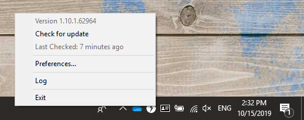
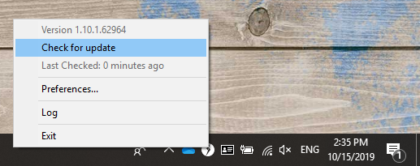
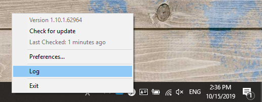
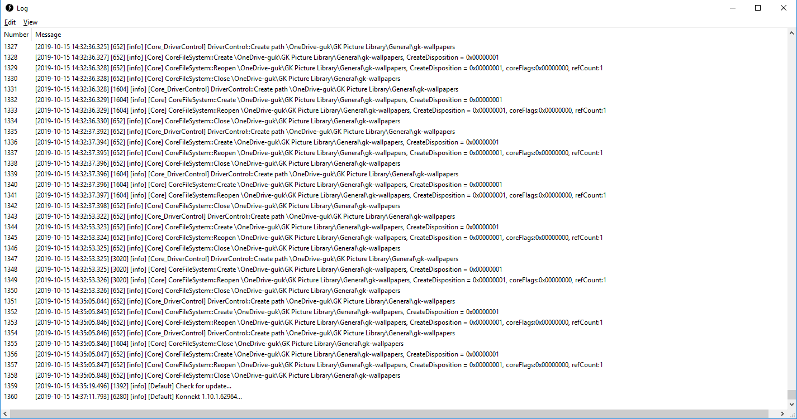
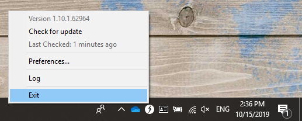

# Tray Menu

To configure basic settings of KONNEKT, you can use the **tray menu**. A right-click on the KONNEKT icon opens the following menu:

### Version

Shows current version of your KONNEKT.

### Check for Update

To check if there is an update for KONNEKT just click **Check for update**. KONNEKT will search for newer version and install it automatically.

### Last Checked

Shows how much time has passed since the last search for an update.

### Log

To get an overview of activities, events and errors of KONNEKT. To open it just click on **Log** in the tray menu.

A Log looks like the following example:

### Exit

If you want to close KONNEKT and stop the connection to SharePoint and OneDrive click **Exit** in the tray menu.


To restart KONNEKT, click the KONNEKT icon in your Windows Explorer, or re-open it from the Start menu.

